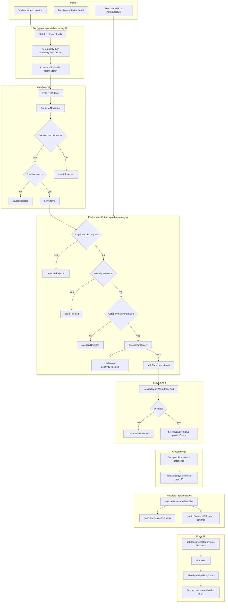

# Hope — App documentation (replace Notion page body)

**Target page:** [Hope App Documentation](https://www.notion.so/rroshraju/Hope-App-Documentation-33bccae826f281e3800df3e49dbdb368)  
**Branch / state:** `ui-updates` (Expo React Native; primary app in root `App.tsx`)  
**Last doc refresh:** 2026-05-03 — reflects Figma-aligned UI, category modal, hidden score, funnel + telemetry as implemented in code.

---

## 1. Product overview

Hope is a mobile news reader that **pulls live RSS-style feeds**, **filters aggressively for constructive / credible stories**, runs **on-device semantic classification** (MobileBERT / ONNX under `src/app/ml/`), and presents a **calm, category-aware feed** with an **in-app WebView** to read sources. Location is used to **label the edition** and to **bias feed URLs** and ordering—not to replace the constructive-news funnel.

---

## 2. Tech stack

| Layer | Choice |
|--------|--------|
| App shell | Expo, React Native |
| Main UI | Root [`App.tsx`](../App.tsx) (fonts, theme, splash, feed, reader modal, category picker) |
| Feeds & categories | [`src/app/data/mockNews.ts`](../src/app/data/mockNews.ts) — `FeedSource`, `buildCategoryFeedUrls`, `categories` |
| Classification | [`src/app/ml/mobilebertClassifier.ts`](../src/app/ml/mobilebertClassifier.ts) — `classifyStoriesWithMobileBert` |
| Fonts | **iOS:** system Avenir Next (`AvenirNext-*`). **Android / web:** bundled Inter (`assets/fonts/`, `expo-font`) |
| Persistence | AsyncStorage — seen stories, caches, diagnostics, metrics history |
| Optional analytics | Google Apps Script URL in `App.tsx` (`postRefreshMetricsToGoogleSheets`) |
| Optional git → Notion | [`scripts/notion-append-commit.mjs`](../scripts/notion-append-commit.mjs) + `.githooks/post-commit` |

---

## 3. What’s new on this branch (high level)

- **Visual design (Figma-aligned):** White shell; hero card `#FFDDD2` with location as the top line, title **Hope**, tagline; story cards with **`#EDF6F9`** header band, **`#142236`** headline, **`#98AFC6`** source/meta, **`#507397`** body, **`#EDEDED`** separators; **16px** corner radius on hero and cards; softer shadows.
- **Category control:** Single **outlined** control (Frame 23 style) opens a **modal** list of categories; chevron is a **small SVG** for consistent alignment with the label.
- **Score in feed:** **Positive score is not shown** on list cards (no ✦ / fraction). **`positiveScore` is still computed**, stored on `NewsItem`, and used for **ordering / banding** (see funnel §5.4).
- **Hero copy:** Top line shows **`userLocation`** (replacing static “Global edition” placeholder). **“Last updated …” removed** from the hero.
- **Splash:** Teal orb / headline colors nudged toward **`#2F7DA0`** / dark ink for consistency with the new palette.
- **Git hook:** Notion append script logs **`fetch` error `cause`** when the network fails (e.g. sandboxed commits).

---

## 4. User-facing flows (short)

1. **Launch** → splash while fonts / first load → home feed.
2. **Location** → `expo-location` (when permitted) updates `userLocation` + `locationContext` used for feed mix and labels.
3. **Pull to refresh** → re-detect location (on refresh path) → reload stories.
4. **Category** → modal picker → `activeCategory` → `getStoriesForCategory` + unseen filter → list.
5. **Story tap** → mark seen (AsyncStorage) → full-screen **reader** (header + meta bar + WebView).
6. **Load more** → increases visible slice of the **already-fetched** pool (does not re-fetch feeds by itself).

---

## 5. Story funnel (end-to-end) — dedicated section

This is the path from **remote RSS XML** to **pixels on the home list**. All stage names below match **diagnostics / funnel counters** logged in `[Hope Funnel]` and optional Sheets payloads (`metrics.funnel.*`).

### 5.1 Stages (ordered)

1. **Edition & feed selection**  
   - `buildCategoryFeedUrls(locationContext)` builds per-category feed lists.  
   - Feeds are **rotated** with `visitCount` (and category index) so the same visit doesn’t always hit the same RSS endpoints first.

2. **Parallel fetch by category**  
   - For each category ≠ `All`, `fetchAllStories` runs in parallel.  
   - Within a category: tiers **`priority` → `secondary` → `fallback`** until **`categoryTargetStoryCount` (20)** accepted stories **or** tiers exhausted.  
   - Feed requests run in **chunks of `feedParallelism` (6)** (`Promise.allSettled` per chunk).

3. **`fetchFeedUrl` — XML → candidate items**  
   - HTTP fetch with cache-busting query param; XML parsed to `NewsItem[]`.  
   - **Per-item gates (diagnostics):**  
     - **Invalid:** missing title/url or **older than 30 days** → `invalidRejected`.  
     - **Source credibility:** `hasCredibleSource` → else `sourceRejected`.  
   - Surviving rows become **`newsItems`** for that feed response.

4. **Per-story acceptance loop (inside category fetch)**  
   For each item from `newsItems` (until category cap):  
   - **Duplicate URL** within this category pass → `duplicateRejected`.  
   - **Previously opened** (`seenStories` from AsyncStorage) → `seenRejected`.  
   - **Category match** (`matchesCategory` + keyword signals) → else `categoryRejected`.  
   - **Hard safety** `passesHardSafety` (combined title + description + source): credible source (again), clickbait heuristics, **negative keyword** list → failures increment **`ruleFilteredCount`** / **`positivityRejected`**.  
   - Survivors → **`safeCandidates`** for one **batched** MobileBERT call.

5. **MobileBERT classification**  
   - `classifyStoriesWithMobileBert(safeCandidates)` → per-URL `accepted` + **`positiveScore`**.  
   - Cache hits vs fresh runs are counted (`mobileBertCacheHits`, `mobileBertFreshClassified`).  
   - Missing result or `accepted: false` → **`constructiveRejected`** (+ `positivityRejected`).  
   - Accepted → stored in category map with **`positiveScore`**.

6. **Merge & global cap**  
   - Category results merged into **`allAcceptedStories`** (dedupe by URL).  
   - **`mixStoriesByFreshness`** applied globally with **`targetStoryCount` (150)**.

7. **`loadStories` after fetch**  
   - **`sanitizeStories`**: drops items failing `hasCredibleSource` again.  
   - **Cache write** on fresh fetch (`saveStoriesCache`).  
   - **`enrichStories`** (async): for each story, optional **HTML fetch** of article URL to **`buildIntroFromHtml`** for a better `description`; on failure, **truncated** feed description.

8. **UI pool**  
   - **`getStoriesForCategory`** (+ `mixStoriesByFreshness` / `mixAllCategoryStories` when `All`).  
   - Filter **`seenStories`** for the list.  
   - **`visibleStoryCount`** slices the pool; **Load more** increases the slice.

### 5.2 Ordering after acceptance (`mixStoriesByFreshness`)

Stories are split into **quality bands** by `positiveScore`: **≥8 (strong)**, **5–7 (solid)**, **&lt;5 (steady)**. Within each band, sort by:

1. **Published today** (fresher first among peers),  
2. **`localityScore`** vs `locationContext`,  
3. **Recency** (`publishedAt`),  
4. Stable **`url`** tie-break.

Then the three bands are **interleaved in proportion** (see `mixStoriesByFreshness` buckets in `App.tsx`) so the feed is not “all tens then all fives.”

### 5.3 Telemetry snapshot

Each refresh logs a single line like:

`[Hope Funnel] fetched=… valid=… source=… deduped=… unseen=… matched=… accepted=… rejected=… ruleFiltered=… mobilebertFresh=… mobilebertCacheHits=… mobilebertTotal=… ruleClassifier=…`

Same counts are summarized in **`metrics.funnel`** for optional Google Sheets POST.

### 5.4 Flow diagram (Mermaid)

Paste into any Mermaid-capable viewer, or Notion if your workspace supports Mermaid blocks:



---

## 6. Caching & offline behavior

- **Stories cache** — TTL and keys in `App.tsx` (`storiesCacheStorageKey`, etc.); refresh path can reuse cache when valid.  
- **Seen stories** — cooldown so items can eventually reappear (see `seenStoryCooldownMs`).  
- **Diagnostics / metrics history** — persisted for debugging and Sheets payloads.

---

## 7. Reader modal

- Full-screen `Modal` + `SafeAreaView`.  
- Header: category eyebrow, **source** title line, story title snippet, **Done** (CTA teal).  
- Meta bar: time • location.  
- **WebView** loads `story.url`; loading overlay while navigating.

---

## 8. Optional: Notion commit timeline

See repo [`README.md`](../README.md) — `NOTION_TOKEN` in `.env`, `npm run hooks:install`, script `scripts/notion-append-commit.mjs` (**PATCH** append blocks). Commits succeed even if Notion `fetch` fails (e.g. no network in some environments).

---

## 9. Runbook (dev)

```bash
npm install
npm run start
# or
npm run ios
```

Typecheck: `npx tsc --noEmit`

---

## 10. How to apply in Notion

1. Open [Hope App Documentation](https://www.notion.so/rroshraju/Hope-App-Documentation-33bccae826f281e3800df3e49dbdb368).  
2. Select all existing body content → delete (or archive the old page).  
3. Paste from this file (Notion may need you to paste section-by-section for very large pages).  
4. For **§5.4**, if Mermaid is not supported, use Notion’s **diagram** block or export the Mermaid to PNG via [mermaid.live](https://mermaid.live) and embed the image.

---

*Generated from the Hope repository for sync with Notion; edit either side and re-export as needed.*
